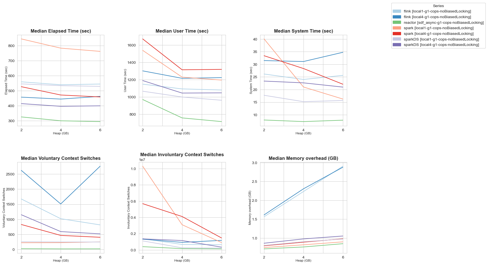

# beam-tpcds-benchmarks

This project provides some tooling to easily benchmark Beam runners using the TPCDS benchmark suite of Beam using different configurations with the goal to easily gather metrics beyond the published ones at http://metrics.beam.apache.org.

Metrics on particular queries are parsed from the benchmark output. Overall metrics for an entire benchmark run (involving multiple queries) are gathered using the `time` command:



### Instructions

1.  Configure a Python environment to run Jupyter notebooks, e.g. using `conda`:
    ```
    conda config --add channels conda-forge
    conda create python=3.9 -n jupyter-py39
    conda activate jupyter-py39
    conda install jupyter pyspark ipykernel nb_conda seaborn vega pandas
    ```
2.  Pull the code of Beam and this repo. Note: You will also need a copy of Beam's tpcds input data.
3.  Configure `config.ipynb` accordingly.
4.  Additionally you have to add the following task to `build.gradle` of Beam's tpcds module to export the classpath. 
    ```
    if(project.hasProperty("target")) {
        task cpcopy(type: Copy) {
            dependsOn classes
            from configurations.gradleRun.asFileTree.files
            into file(project.findProperty("target")) // replace with the path to your desired directory
            include '**/*.jar'
        }
    }
    ```
5. Run your benchmarks using the provided [notebook](benchmark-runner.ipynb).

### Troubleshooting

Exporting the classpath using the task above doesn't always work reliably. If you see a `ClassNotFoundException`, try running tpcds from gradle first.

```
gradle :sdks:java:testing:tpcds:run -Ptpcds.runner=":runners:flink:1.16" -Ptpcds.args=" \
  --runner=FlinkRunner \
  --queries=3,7,10 \
  --tpcParallel=1 \
  --sourceType=PARQUET \
  --dataDirectory=/tmp/tpcds/nonpartitioned \
  --dataSize=1GB  \
  --resultsDirectory=/tmp/tpcds_results/"
```